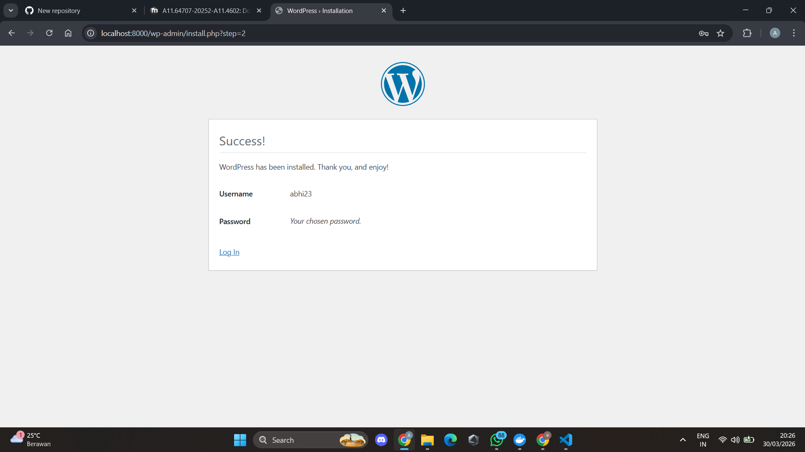
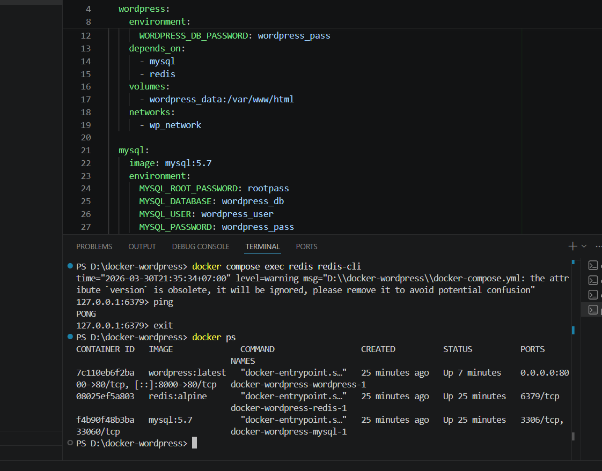
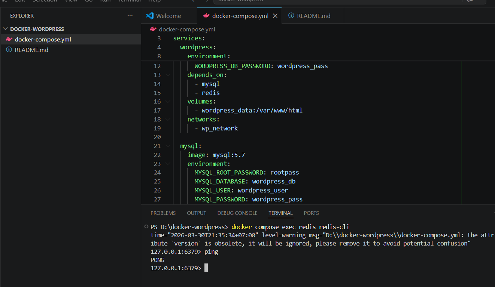
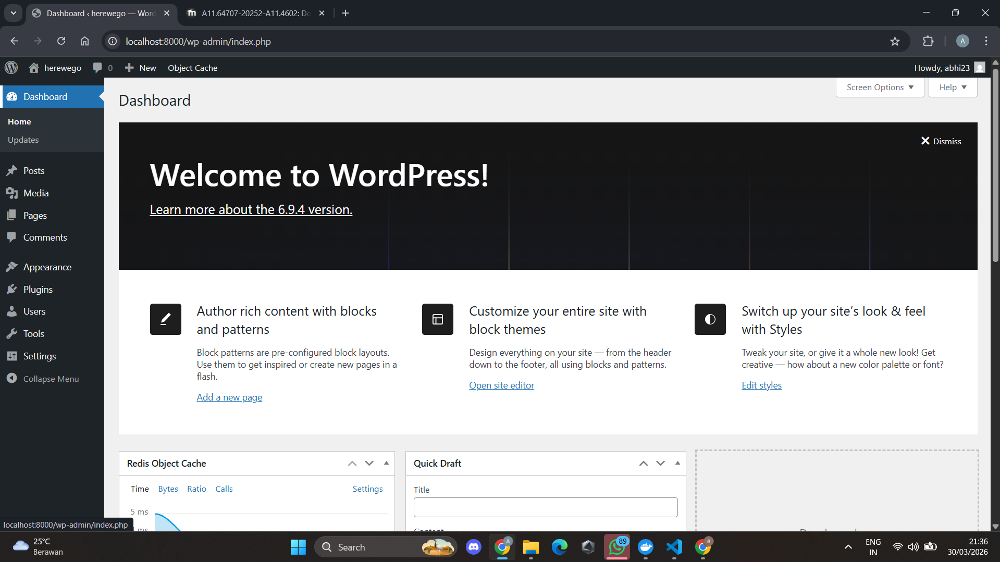

# WordPress Docker Setup (MySQL + Redis)

## Deskripsi

Project ini merupakan implementasi **multi-container Docker Compose** yang menjalankan:

* WordPress sebagai CMS
* MySQL sebagai database
* Redis sebagai object cache

Tujuan project ini adalah memahami konsep:

* Multi-container orchestration
* Docker networking
* Volume persistence
* Service dependencies

---

## Arsitektur

```
[ Browser ]
     ↓
[ WordPress ]
     ↓
[ MySQL ]   +   [ Redis (Cache) ]
```

---

## Teknologi yang Digunakan

* Docker & Docker Compose
* WordPress (latest)
* MySQL 5.7
* Redis (alpine)

---

## Cara Menjalankan Project

### 1. Jalankan container

```
docker compose up -d
```

### 2. Akses WordPress

```
http://localhost:8000
```

### 3. Install WordPress

Isi:

* herewego
* abhi23
* abhirama23

---

## Konfigurasi Penting

### Database Connection

```
WORDPRESS_DB_HOST=mysql:3306
```

### Redis Configuration

Tambahkan di `wp-config.php`:

```php
define('WP_REDIS_HOST', 'redis');
define('WP_REDIS_PORT', 6379);
```

---

## Hasil Pengujian

### 1. Container Berjalan

Semua container berhasil dijalankan:

* wordpress
* mysql
* redis

---

### 2. Redis Berjalan

Test Redis:

```
docker compose exec redis redis-cli
ping
```

Hasil:

```
PONG
```

---

### 3. WordPress Berjalan

* Dashboard berhasil diakses
* Bisa membuat post/page

---

## Screenshot

### 🔹 WordPress installation page



### 🔹 Docker Container Running



### 🔹 Redis Test (PONG)



### 🔹 WordPress Dashboard



---

## Volume Persistence

Digunakan untuk:

* Menyimpan data MySQL
* Menyimpan file WordPress

Agar data tidak hilang saat container restart

---

## Jawaban Pertanyaan

### 1. Kenapa perlu volume untuk MySQL?

Agar data database tetap tersimpan meskipun container dihentikan atau dihapus.

---

### 2. Apa fungsi depends_on?

Untuk mengatur urutan startup container agar WordPress dijalankan setelah MySQL dan Redis.

---

### 3. Bagaimana WordPress connect ke MySQL?

Melalui Docker network menggunakan:

```
mysql:3306
```

---

### 4. Apa keuntungan Redis?

* Mempercepat loading website
* Mengurangi beban database
* Meningkatkan performa WordPress

---

## Author

Nama: Abhirama Maulana Putra
Project: Dockerize WordPress dengan MySQL dan Redis